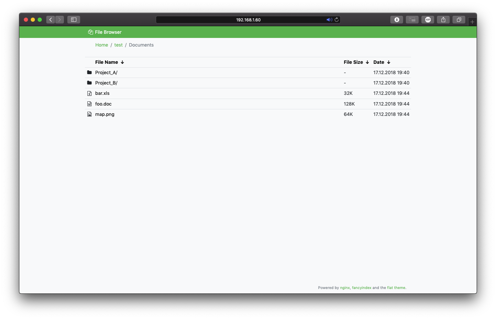

# Flat theme for nginx's fancyindex module

<a href="https://getbootstrap.com/docs">
    
</a>
<a href="https://docs.fontawesome.com/">
    
</a>




## About

The [fancyindex module](https://github.com/aperezdc/ngx-fancyindex) of
[nginx](http://nginx.org/) has the powerful capability to be customizable.
Instead of using an external application, this gives us the ability to use
just the webserver's capabilities to generate beautiful directory listings.

This theme provides a simple, flat interface based on
[Bootstrap 5](https://getbootstrap.com) and [Font Awesome](https://fontawesome.com).

## Prerequisites
A fontawesome key is required for the icons. \
You will have to create an account and get a key for free. \
@see https://fontawesome.com/kits

For developers, if you want to generate the build, you would have to install the following. \
Nodejs: \
@see https://nodejs.org/en/download

Libraries:
```sh
# css compiler
npm i -g less less-plugin-clean-css
# javascript minifier
npm i -g uglify-js
```
Also, you might have to install make depending on your operating system.
I used choco on Windows, but there are other possible methods:
```sh
# https://community.chocolatey.org/packages/make
choco install make
```

## Usage

1. Get the latest resources from [GitHub releases][releases], or build them
   yourself by running `make` inside this repository. Instructions on how to
   build the resources can be found [below](#build).
2. Copy these files into any location accessible by *nginx*.
3. Configure your vhost to use the theme's resources for fancyindex:
    ```
    # Fancyindex
    fancyindex             on;
    fancyindex_header      "/theme/header.html";
    fancyindex_footer      "/theme/footer.html";
    fancyindex_show_path   off;
    fancyindex_name_length 255;
    fancyindex_exact_size  off;
    fancyindex_localtime   on;

    location /theme/{
        alias /srv/www/fileserver/theme/;
    }
    ```

[releases]: https://github.com/alehaa/nginx-fancyindex-flat-theme/releases


## Build

Instead of using pre-built sources, you can build them on a local machine. For
convenience, a [Dockerfile](Dockerfile) is provided that creates a container
with all the necessary tools to compile the sources. You can easily build the
theme using the following commands:

```
docker build -t fancyindex-flat .
docker run --rm -it -v ./:/mnt -w /mnt fancyindex-flat make
```

The compiled sources for the theme will be located in the `build` directory.

## License

The nginx-fancyindex-flat-theme is free software: you can redistribute it and/or
modify it under the terms of the GNU General Public License as published by the
Free Software Foundation, either version 3 of the License, or (at your option)
any later version.

This software is distributed in the hope that it will be useful, but **WITHOUT
ANY WARRANTY**; without even the implied warranty of **MERCHANTABILITY** or
**FITNESS FOR A PARTICULAR PURPOSE**. A Copy of the GNU General Public License
can be found in the [LICENSE](LICENSE) file.

&copy; 2018-2024 Alexander Haase
